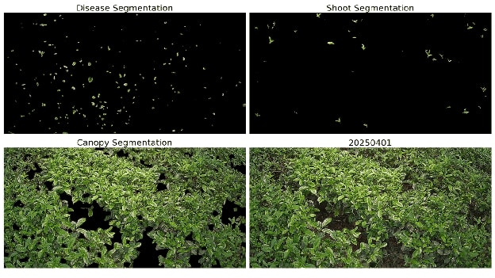

**Digital twins** are virtual representations of physical systems that integrate real-world data to support monitoring, prediction, and decision-making. Our research explores the potential of digital twins in agriculture, with a particular focus on modelling plant growth under varying environmental conditions and using these insights to optimise resource utilisation. We deploy environmental sensors and cameras to monitor plantations and apply computer vision-based **plant phenotyping**, which involves measuring observable plant traits such as growth, canopy structure, and shoot development from images. Our current work focuses primarily on developing digital twins for tea growth modelling. The research group received a **Rs. 20 million grant** from the National Research Council to further develop this concept. Our main research site is an agrivoltaic facility in Hanthana, where tea growth is studied under different environmental conditions. This multidisciplinary research brings together expertise from engineering, agriculture, and botany to develop data-driven approaches for sustainable and resource-efficient agriculture.

