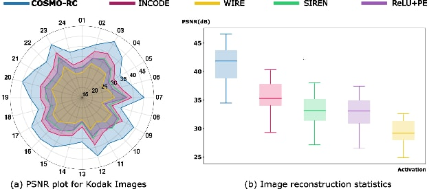

**Implicit Neural Representations** (INRs) are neural networks that represent signals such as images, audio, 3D shapes, and other continuous data as functions of their spatial or temporal coordinates. Our research on INRs spans both fundamental theory and practical applications. A major theoretical focus is **spectral bias**, the tendency of neural networks to learn low-frequency components of a signal faster than high-frequency details. Through our studies, we identified that odd or even symmetry in activation functions contributes to this behaviour. To address this limitation, we proposed COSMO-INR, a new INR framework that achieved state-of-the-art performance across several INR benchmarks. **COSMO-INR** was published at **ICLR 2026**, marking the first top-tier AI conference paper produced by a fully Sri Lankan-affiliated research team. Beyond theory, we apply our INR advances to real-world problems, including restoration of degraded historical images for cultural heritage preservation through the **Heritage AI** project, supported by the **NVIDIA Academic Grant**.

